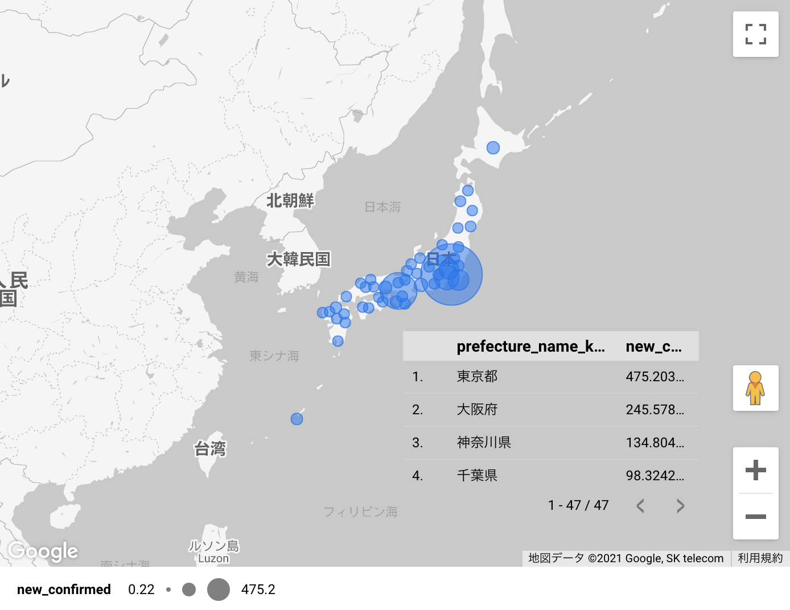

# マネーフォワードケッサイのBigQuery活用

---

# Naofumi Yamada

[@na0fu3y](https://twitter.com/na0fu3y)
[データエンジニア](https://www.notion.so/na0-Naofumi-Yamada-376a1c53b1a547a79abc1fe01daa268a) 
bqfun.jp  管理人

ミッション「データに依存してもらう」


---

# 


サービス
- 
- 
- 


---

# マネーフォワードケッサイのBigQuery活用

- BigQuery GISで地理情報活用
- Google Cloudで構造化データの機械学習
- 本に載ってないけど便利なツール群
- 自動与信のためのデータ基盤
- Data Cloud Summitで発表されたデータクラウドサービス

[Google Cloudではじめる実践データエンジニアリング入門](https://gihyo.jp/book/2021/978-4-297-11948-5)前提です

---


# BigQueryによる地理情報分析

---

## BigQuery GISで地理情報活用

### 例
[BigQuery の一般公開境界データセットを活用した地理空間分析](https://cloud.google.com/blog/ja/topics/developers-practitioners/leveraging-bigquery-public-boundaries-datasets-geospatial-analytics)


```sql
SELECT
   id,
   ST_GEOGPOINT(longitude, latitude) AS point
FROM `looker-private-demo.retail.customers`
```


---

### BigQuery GISのハードル
GEOGRAPHY型：緯度経度の組の組

- 点→デバイスの位置、施設の位置
- 線→道路の中心線、河川
- ポリゴン→行政区画、建物の区画

**GEOGRAPHY型の整備は結構大変**


---

### GEOGRAPHY型を準備するには

- [Google Maps Geocoding API](https://developers.google.com/maps/documentation/geocoding/overview)
- [Geolonia 住所データ](https://geolonia.github.io/japanese-addresses/)
- [GISホームページ](https://nlftp.mlit.go.jp/) など

---

### データポータルなら？

所在地文字列も可視化できる！

```sql
SELECT
  prefecture_name_kanji,
  new_confirmed
FROM
  `bigquery-public-data.covid19_public_forecasts.japan_prefecture_28d`
WHERE
  prediction_date = "2021-07-20"
```



---

# Google Cloudで構造化データの機械学習

---

## BigQuery ML

### 学習の例

テーブル用意して`CREATE MODEL`を呼ぶだけ！

```
CREATE OR REPLACE MODEL
  `my_dataset.my_model` OPTIONS(model_type="autoencoder") AS
SELECT
  *
FROM
  `my_dataset.my_table`
```

（Amazon Redshift MLにも類似の機能があります）

---

### 推論の例

テーブル用意して`ML.PREDICT`や`ML.DETECT_ANOMALIES`を呼ぶだけ！

```
SELECT
  *
FROM
  ML.DETECT_ANOMALIES(MODEL `my_dataset.my_model`,
    STRUCT(0.02 AS contamination),
    TABLE `my_dataset.my_table`);
```

（`ML.PREDICT`相当の関数がモデル別にあります）

---

### できること
- 分類、回帰、クラスタリング、レコメンデーション、次元削減
  - モデルを選ぶ際は専門家になるか、呼ぶかAutoMLか

### 苦手なこと
- 高速応答
  - TensorFlow SavedModel経由でVertex AIにインポートしてデプロイ

---

### 便利なこと
- モデルの評価機能が内包
- SQLを書いて、ビジネス的に価値があるかすぐデータで評価
- データポータルで予測値を眺める

---

## AutoML Tables
テーブルデータ+$19.32+1時間→回帰 or 分類モデル完成

### できること

- デプロイしてオンライン予測も簡単
- 予測寄与率も出る
- 適当な前処理で、そこそこの性能

---

### 注意

- 評価も出るけど、ビジネス上の評価は別でちゃんとやろう
- ビジネス利用する際は注意ポイント色々
- BigQuery MLから呼ぶとAutoML Tablesから見えない

---

# 本に載ってないけど便利なツール群

---

## Dataprep by Trifacta
データ前処理をグラフィカルに定義できるサービス。
視覚的に分かりやすいのでデータ探索にも。


---

## Datastream（2021-05-26プレビュー）
Data FusionのWeb UIをぽちぽちするだけで、リアルタイムCDC転送。


---

## Cloud SQL

フルマネージド リレーショナル データベース サービス


---

## Dataform

SQLを拡張したSQLXを書いて、データ定義、検証、依存解消まとめて実行。
通知や定期実行も可能。無料。2020年にGoogle Cloudが買収。


---

## Embulk
オープンソースのデータ転送アプリケーション


---

## Airbyte
オープンソースのデータ転送アプリケーション


---

# 自動与信のためのデータ基盤

---
## 与信審査がボトルネック

与信審査で利用企業を待たせたくない
→与信審査を自動化したい！

### 与信審査自動化を推進する仕組み
- 手軽なデータ探索
- 全社で共通定義のデータ
- 検証可能なリリースサイクル
- データとパイプラインの品質計測


---

## 手軽なデータ探索
- ほぼ全ての社内データにBigQueryからアクセス可能
- 自動与信に有効なデータをBigQuery完結で探索

### リアルタイム
- Cloud SQL連携クエリ
- スプレッドシート
- Cloud Storage
  - Cloud Composerでパブリックデータを定期収集

### 定期更新
- Salesforceなどのサービス
  - AirbyteやCloud Composerで定期収集

---

### 外部データソースへのクエリは遅い
BigQueryに再配置するため遅い
（Cloud Storageへのクエリはキャッシュが効く）

Cloud Composerから毎時や毎日、**実体化して探索速度をアップ**
- ラベル `materialization_frequency` をつけたリソースをCloud Composerで管理

参考：[マネーフォワード ケッサイのBigQueryリソース ラベル規約](https://tech.mfkessai.co.jp/2021/02/bigquery_labels/)

---

## 全社で共通定義のデータ
KPIをデータ部門がBigQueryのビューで定義

- 手動審査と自動審査の定義差異を最小化
- ビュー経由でデータ連携するため、どのツールでも同一定義のデータ

### ビューを育てるために
- Dataformでビューを継続的に検証

---

## 検証可能なリリースサイクル
- ルールベースとAutoML Tablesの組み合わせ
  - オリジナルモデルのチューニングコストとAutoML Tablesで相談
- BigQueryのデータでリリース前に影響確認
- 機械学習モデルはリリース後に性能劣化が起きていないか目視チェック

---

## データとパイプラインの品質計測
### データの品質チェック
- 審査対象の情報網羅性、最新性など
  - BigQueryに定期的なデータチェッククエリを発行
### データパイプラインチェック
- データ連携は要求に対してどのくらい遅延するか
- データ参照は要求に対してどのくらい遅延するか

---

# まとめ

---

## 与信審査自動化を推進するデータビューアとしてのBigQueryを整備
手軽にデータ探索、リリース検証

## Roadmap
カタログ整備
- 複数転送されている同一データを同一視可能に
- アプリケーションから使うべきデータソースが明らかに

---

# Data Cloud Summit「データクラウドサービス」

---

## Dataplex
プレビュー
- データポリシーを一貫制御
- 自動でデータ品質チェック、メタデータを検索可能に
- ノートブックとSQLワークベンチを統合、スケジューリングなどが可能に

参考：[Dataplex のご紹介 - データ管理を一元化できるインテリジェントなデータ ファブリック](https://cloud.google.com/blog/ja/products/data-analytics/introducing-google-cloud-dataplex)


---

## Datastream
略

---

## Analytics Hub
プレビュー。データセットやBigQuery MLモデルなどを公開、購読可能に。
データの収益化も！

参考：[Analytics Hub のご紹介 -- 簡単、安全、スケーラブルにデータ分析を共有](https://cloud.google.com/blog/ja/products/data-analytics/introducing-analytics-hub-for-data-analytics-exchanges)

---

## Vertex AI
一般提供。AI Platformを内包して機能拡大！
MLOpsの開始をお手軽に。

参考：[Google Cloud が Vertex AI を公開: 各種 ML ツールを統合したプラットフォーム](https://cloud.google.com/blog/ja/products/ai-machine-learning/google-cloud-launches-vertex-ai-unified-platform-for-mlops)

---

## Dataflow Prime
プレビュー。賢くなったDataflow。

- リソース自動チューニング
- ビジネスSLOのモニタリング
- パイプラインの修正提案


参考：[Dataflow Prime: ビッグデータ処理で優れた効率と抜本的な簡素化を実現](https://cloud.google.com/blog/ja/products/data-analytics/simplify-and-automate-data-processing-with-dataflow-prime)

---

## Data Cloud Summitまとめ

- Dataplex（プレビュー）
- Datastream（プレビュー）
- Analytics Hub（プレビュー）
- Vertex AI（プレビュー）
- Dataflow Prime（プレビュー）
- Cloud Spanner への BigQuery フェデレーション（近日提供予定）


参考：[Google Cloud の新しいイノベーションでデータクラウドを統合](https://cloud.google.com/blog/ja/products/data-analytics/google-cloud-announces-new-data-cloud-products)
